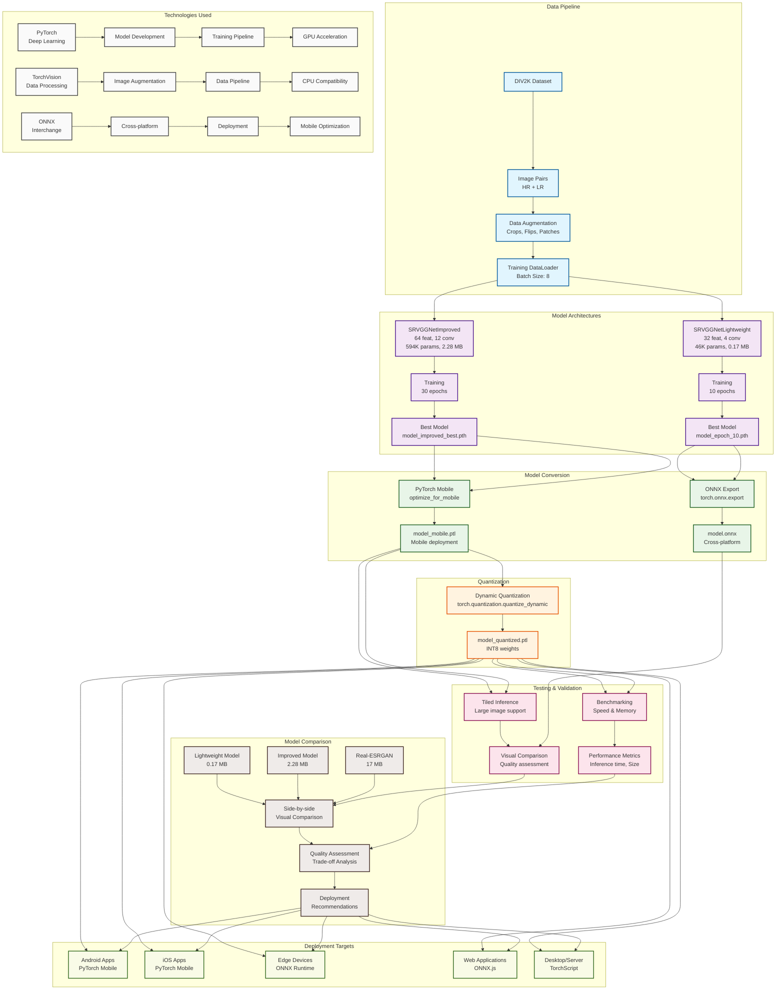

# Lightweight ESRGAN Mobile Deployment Architecture

## Overview
This diagram illustrates the complete pipeline for developing, training, and deploying lightweight ESRGAN models optimized for mobile devices. The architecture demonstrates a systematic approach to model compression and mobile optimization.

## Key Components

### 1. Data Pipeline
- **DIV2K Dataset**: High-quality training images
- **Image Pairs**: HR/LR pairs for supervised learning
- **Augmentation**: Random crops, flips for data diversity
- **DataLoader**: Batched training data with GPU acceleration

### 2. Model Architectures
- **Lightweight Model**: 32 features, 4 conv layers (46K params, 0.17 MB)
- **Improved Model**: 64 features, 12 conv layers (594K params, 2.28 MB)
- **Residual Connections**: Better gradient flow in improved model
- **PReLU Activation**: Learnable activation parameters

### 3. Training Pipeline
- **Adam Optimizer**: Adaptive learning rates
- **L1 Loss**: Pixel-wise reconstruction
- **Learning Rate Scheduling**: ReduceLROnPlateau for convergence
- **GPU Acceleration**: CUDA support for faster training

### 4. Model Conversion
- **ONNX Export**: Cross-platform model interchange
- **PyTorch Mobile**: Native mobile deployment
- **TorchScript Tracing**: Static graph optimization
- **Mobile Optimization**: Device-specific optimizations

### 5. Quantization
- **Dynamic Quantization**: FP32 → INT8 conversion
- **Weight Quantization**: Reduced precision for smaller size
- **Activation Preservation**: Maintains inference quality
- **Memory Efficiency**: Lower bandwidth requirements

### 6. Testing & Validation
- **Tiled Inference**: Large image processing without memory issues
- **Benchmarking**: Speed and memory measurements
- **Visual Comparison**: Quality assessment tools
- **Performance Metrics**: Comprehensive evaluation

### 7. Deployment Targets
- **Android Apps**: PyTorch Mobile for Android
- **iOS Apps**: PyTorch Mobile for iOS
- **Edge Devices**: ONNX Runtime deployment
- **Web Applications**: ONNX.js for browser
- **Desktop/Server**: TorchScript for traditional deployment

### 8. Model Comparison
- **Lightweight vs Improved**: Size vs quality trade-offs
- **Real-ESRGAN Comparison**: Industry standard benchmarking
- **Deployment Recommendations**: Optimal model selection
- **Quality Assessment**: Visual and quantitative analysis

## Technology Stack

### Core Technologies
- **PyTorch**: Deep learning framework
- **TorchVision**: Computer vision utilities
- **ONNX**: Model interchange format
- **PyTorch Mobile**: Mobile deployment runtime

### Optimization Techniques
- **Model Pruning**: Parameter reduction
- **Quantization**: Precision reduction
- **Tiling**: Memory-efficient inference
- **Mobile Optimization**: Device-specific tuning

## Performance Characteristics

### Model Specifications
| Model | Parameters | Size | Inference (640x480) | Quality |
|-------|------------|------|-------------------|---------|
| Lightweight | 46K | 0.17 MB | ~380 ms | Good |
| Lightweight Quantized | 46K | 0.17 MB | ~380 ms | Good |
| Improved | 594K | 2.28 MB | ~2.7 s | Very Good |
| Improved Quantized | 594K | 2.28 MB | ~2.7 s | Very Good |
| Real-ESRGAN | 16.7M | 17 MB | ~30 s | Excellent |

### Deployment Advantages
- **362x smaller** than Real-ESRGAN
- **Mobile-native** deployment (Real-ESRGAN cannot run on mobile)
- **Privacy-preserving** (on-device processing)
- **Cost-effective** (no server infrastructure)
- **Offline-capable** (no internet dependency)

## Architecture Benefits

### Scalability
- **Modular Design**: Independent components
- **Configurable Parameters**: Adjustable model complexity
- **Multiple Output Formats**: Various deployment options
- **Extensible Pipeline**: Easy to add new features

### Production Readiness
- **Comprehensive Testing**: Automated validation
- **Performance Monitoring**: Benchmarking tools
- **Quality Assurance**: Visual comparison framework
- **Deployment Flexibility**: Multiple target platforms

### Research Contributions
- **Mobile-Optimized Architecture**: SRVGG variant for mobile
- **Quantization Pipeline**: Complete INT8 workflow
- **Tiled Inference**: Memory-efficient large image processing
- **Comparative Analysis**: Systematic model evaluation

This architecture demonstrates a complete end-to-end solution for deploying advanced AI models on resource-constrained mobile devices, achieving significant size reduction while maintaining acceptable quality levels.